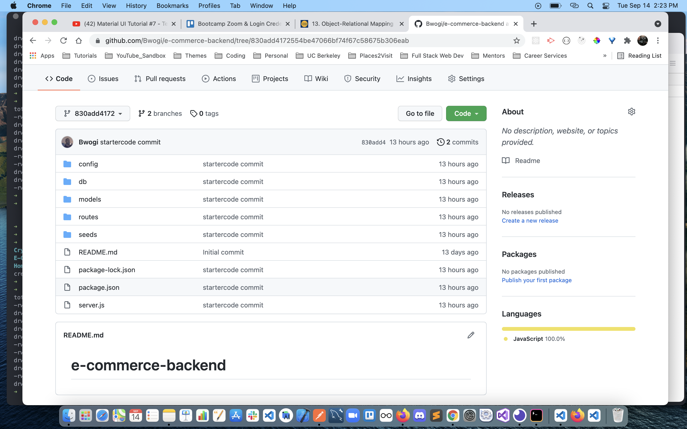

# e-commerce-backend 
  <p align="left">
    
    
    
       
  </p>

  ## User Story
  AS A manager at an internet retail company
  I WANT a back end for my e-commerce website that uses the latest technologies
  SO THAT my company can compete with other e-commerce companies
  ## Description
 Internet retail, also known as e-commerce, is the largest sector of the electronics industry, having generated an estimated US$29 trillion in 2017 (Source: United Nations Conference on Trade and Development). E-commerce platforms like Shopify and WooCommerce provide a suite of services to businesses of all sizes. Due to the prevalence of these platforms, developers should understand the fundamental architecture of e-commerce sites. Your challenge is to build the back end for an e-commerce site. You’ll take a working Express.js API and configure it to use Sequelize to interact with a MySQL database.

  ## Technologies
  NodeJS a JavaScript runtime, MySQL2 and Sequelize packages to connect the Express.js API to the MySQL database, Dotenv package to help sstore sensitive environment variables.

  ## Starter code
   

  ## Project Setup and Use
  * Clone the project source code
  * Connect to MySQL database
  With your own database credentials;
  ```$ mysql -u root -p``` 
  * Create the database schema
  ```mysql> source db/schema.sql;```
  * Exit the database
  ```mysql> exit```
  * Populate the database
  ```$ npm run seed```
  * Start the server
  ```$ npm start```

  ## Mockup
  The following animations show the application's API routes being tested in Insomnia Core.
  1. The first animation shows GET routes to return all categories, all products, and all tags
  [](https://youtu.be/zH_WFaREzBA)

  2. The second animation shows GET routes to return a single category, a single product, and a single tag
  <!-- [](https://youtu.be/d2LD42Bx5Pk) -->

  3. The final animation shows the POST, PUT, and DELETE routes for categories
  <!-- [](https://youtu.be/d2LD42Bx5Pk) -->
  
  ## License 
  [](https://opensource.org/licenses/MIT)<br />
  This app is covered under MIT license.
  ## Project repository 
  https://github.com/bwogi/e-commerce-backend
  ## Contributors
  Developed by Andrew Bwogi